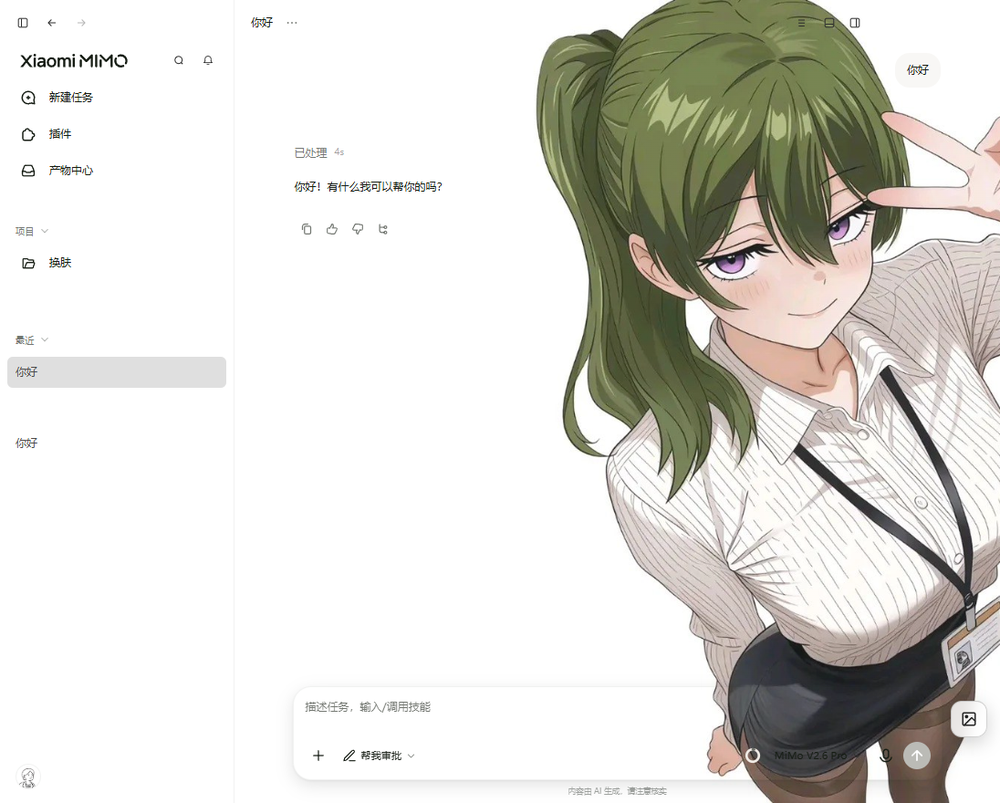
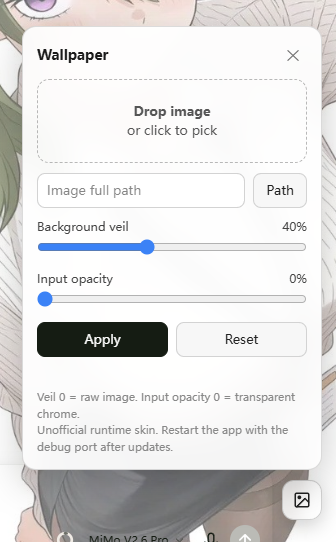
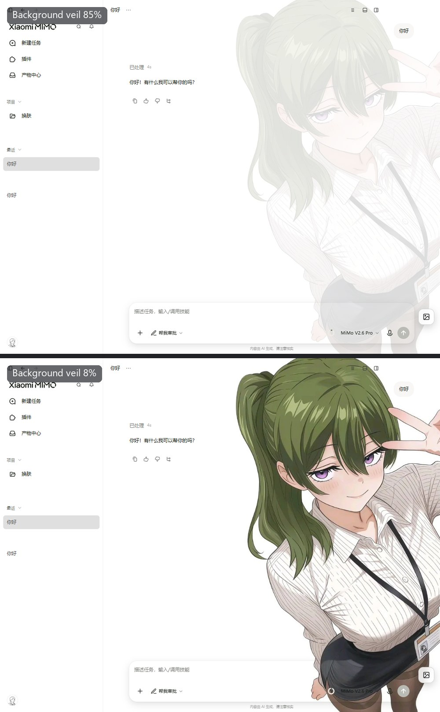
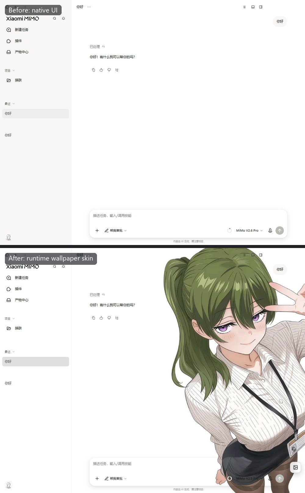

# electron-wallpaper-panel

[](LICENSE)
[](https://nodejs.org)

Unofficial **wallpaper / glass-skin** toolkit for Electron desktop apps.

Floating control panel (drag & drop, file picker, path, live veil / input-opacity
sliders) + a small CLI that injects and restores styles over the Chrome DevTools
Protocol (CDP).

**中文说明:** [README.zh-CN.md](README.zh-CN.md)

> **Unofficial.** Not affiliated with, endorsed by, or sponsored by Xiaomi, Mimo,
> WorkBuddy, or any other app vendor. Use at your own risk. Host updates may break
> selectors — that is expected. See [docs/UNOFFICIAL.md](docs/UNOFFICIAL.md).



## Features

- One-click apply / restore (runtime only — **no** app file patching)
- Floating panel: drop image, pick file, path field
- Live **background veil** 0–100% and **input opacity** 0–100%
- Multi-app **profiles** (`mimo-desktop`, `workbuddy`, `generic-electron`)
- Panel UI in **English or Chinese**, auto-detected from the host app (`--lang` to force)
- `probe` tool to find opaque ancestors after app updates

## Screenshots

The floating panel and its launcher button:



Same wallpaper, two background-veil settings (runtime only, nothing to restart):



Native UI above, wallpaper skin below:



More about how these were captured: [docs/screenshots/README.md](docs/screenshots/README.md).

## How it works

1. Start the target Electron app with `--remote-debugging-port=9346` (loopback).
2. `ewp` injects CSS + the floating panel into the renderer.
3. Chrome surfaces (sidebar / main / composer frame) are cleared so the image shows.
4. Content surfaces (preview panels, cards, menus) stay opaque on purpose.

## Requirements

- Node.js **18+** (built-in `WebSocket`)
- A Chromium/Electron app that accepts `--remote-debugging-port`

## Install

```bash
git clone https://github.com/Daizhdd/electron-wallpaper-panel.git
cd electron-wallpaper-panel
node -e "console.log('ready')"
# optional: npm link   # exposes `ewp`
# optional: npm install   # runs postinstall and prints the next steps
```

**After install — nothing is automatic.** Cloning (or `npm install`) does not skin any app. You still need the three Quick start steps below: start with a debug port → `ewp apply` → `ewp restore` when done.

## Quick start

```bash
# 1) start your app with a debug port (example)
"/path/to/App.exe" --remote-debugging-port=9346

# 2) apply a wallpaper
node bin/ewp.js apply --profile profiles/mimo-desktop.json --image ./wallpaper.jpg

# 3) restore native look
node bin/ewp.js restore --profile profiles/mimo-desktop.json
```

Or use the helper: [`scripts/launch-with-port.ps1`](scripts/README.md).

### Optional: double-click shortcut that launches skinned (Windows)

Cloning does **not** rewrite your shortcuts. For a double-click flow that starts
the app with CDP and applies the wallpaper:

1. Copy and edit local config:
   ```powershell
   Copy-Item scripts\launcher.config.example.json scripts\launcher.config.json
   notepad scripts\launcher.config.json
   ```
2. Repoint Desktop/Start Menu shortcuts (backs up originals first):
   ```powershell
   powershell -NoProfile -ExecutionPolicy Bypass -File scripts\repoint-mimo-shortcuts.ps1
   ```
3. Launch via the updated shortcut. Details: [`scripts/README.md`](scripts/README.md).

After `apply`, a small **image** button appears at the bottom-right of the app window.

| Control | Meaning |
| --- | --- |
| Drop / pick | Instant preview; veil auto-suggest from mean luminance |
| Path | Best-effort `file://` URL |
| Background veil | 0 = raw image, 100 = heavy light/dark veil |
| Input opacity | 0 = transparent composer chrome, 100 = opaque |
| Apply / Reset | Pin slider values / remove the skin |

## CLI

```text
ewp apply   --profile <file> [--image <path>] [--port 9346] [--scrim 0-1] [--lang <code>]
ewp restore [--port 9346]
ewp status  [--port 9346]
ewp probe   [--port 9346]
```

- `--image` is embedded as a data URL (stays local).
- Without `--image`, use the panel’s drop / file picker.
- Scrim auto-guess is approximate; fine-tune with the slider.
- `--lang en-US` / `--lang zh-CN` forces the panel language; without it the panel
  follows the host app language (`navigator.language`). `EWP_LANG` works too.

## Profiles

See [docs/profile-schema.md](docs/profile-schema.md) and [docs/troubleshooting.md](docs/troubleshooting.md).

| File | Target (compatibility label only) |
| --- | --- |
| `profiles/mimo-desktop.json` | Xiaomi MiMo Desktop |
| `profiles/workbuddy.json` | WorkBuddy |
| `profiles/generic-electron.json` | Generic Electron (best effort) |

Version notes: [docs/calibration.md](docs/calibration.md)

## Security

Debug ports are powerful. Loopback only. Details: [SECURITY.md](SECURITY.md).

## Why not a native plugin?

Most host apps do not ship a UI-extension API. Runtime CSS + a tiny injected panel
is the practical unofficial route. No fake “official theme store”, no bundle patching.

## Changelog

[CHANGELOG.md](CHANGELOG.md) · [CONTRIBUTING.md](CONTRIBUTING.md)

## License

MIT — see [LICENSE](LICENSE).
